  <h1>Hi there, I'm Bernal 👋</h1>
  <h3>Software Engineering Student @ UTN | Tech Explorer & Problem Solver</h3>
  
<i>Building tools to help myself and others create better products.</i>

 

### 👨‍💻 About Me

I am currently a Software Engineering student at UTN, based in Costa Rica. I'm constantly exploring the tech world, actively seeking out new tools and technologies to improve my own development workflows and help others build better, higher-quality products. I believe that the right tools combined with clean code can make a huge difference in any project.

 

### 🛠️ My Tech Stack & Tools

**Languages** 

  
  
  
  
  
  
  

**Frontend & Design** 

  
  
  
  

**Tools & Databases** 

  
  
  
  

 

### 📊 My GitHub Activity

  

 

### 📫 Let's Connect

  

